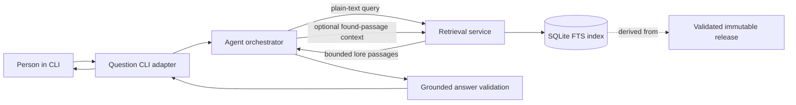
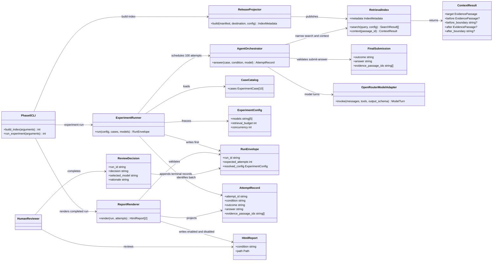

# Technical Design: agent lore retrieval first vertical pass

## Context and Constraints

### Objective

Design two ordered deliveries. Phase 0 is a prerequisite experiment that compares five small OpenRouter models over five easy and five hard Tolkien lore questions in a local HTML report. Only after that experiment selects a suitable model does Phase 1 build the first end-to-end vertical pass in which a person asks a basic question through the full-screen `meta` cockpit, an agent queries a SQLite FTS projection before composing an answer, and the cockpit presents a grounded response.

This document covers technical design only. Implementation, dependency installation, commits, and product-document changes are outside this TDD phase.

### Authoritative inputs

- The initiating request requires a basic CLI, comparable in spirit to the existing curation cockpit, that answers basic lore questions.
- The first CLI is a full-screen raw-terminal cockpit, not a one-shot command or line-oriented REPL.
- The cockpit resolves one minimally activated release and compatible retrieval index from local operator-owned state. Neither the cockpit user nor the agent supplies release or index paths at runtime.
- The first model should be deliberately small and should not be selected for strong Tolkien knowledge. Its suitability must be measured rather than inferred from size or marketing so the vertical pass can distinguish corpus grounding from pretrained recall.
- Live model inference will use OpenRouter. The operator's API key, five Phase 0 candidate model identifiers, and eventual Phase 1 model identifier are loaded from the ignored `.env` file.
- A versioned `.env.example` will document a blank API-key placeholder and will eventually default the model setting to the exact OpenRouter model identifier that passes the grounding evaluation. No real key may appear in that file or elsewhere in git.
- Agent orchestration will use the smallest practical LangChain integration. LangChain is an implementation aid rather than the owner of retrieval, grounding, release selection, or report contracts.
- The experiment suite contains exactly ten reviewed lore questions: five easy and five hard. It evaluates five configured OpenRouter models in one batch and produces an HTML matrix with one question per row and one model per response column.
- The experiment code is intentionally disposable. Retained case definitions, run metadata, and reports must still be reproducible enough to support model comparison.
- Phase 0 is delivered and reviewed before Phase 1 implementation begins. Its selected model becomes the initial `.env.example` model default and a fixed input to the cockpit design.
- Phase 0 code is mechanical assistance: it runs the declared questions against the declared models, captures results, and populates the comparison HTML. A human reads the report and decides what the responses demonstrate; code does not score, rank, judge, or select a model.
- The report must make the exact question under review easy to find while comparing responses, rather than requiring the reviewer to cross-reference an opaque case ID or another file.
- Phase 0 takes explicit operator-supplied release-manifest and SQLite-index paths. It does not create or consume active-runtime state; activation remains Phase 1 work.
- Explicit paths are application control inputs, not model tools. The model receives approved passage text only through the narrow search and context operations and cannot read the manifest, filesystem, or SQLite connection directly.
- Phase 0 renders retrieval-enabled answers and retrieval-disabled controls as two separate HTML reports. Both reports come from the same structured run and use identical question rows and model-column ordering.
- Retrieval-enabled response cells show the answer first and keep supporting retrieval details in an expandable evidence section. Each displayed passage includes its title, section, excerpt, and stable passage ID. Retrieval-disabled cells show the answer without an evidence section and state that retrieval supplied no evidence.
- The Phase 0 gate is a human-authored qualitative decision with written rationale and no numeric threshold. The reviewer records one exact qualifying model identifier or records that none of the five qualifies.
- Every answer attempt defaults to a four-call retrieval budget. Its first retrieval call must be search; the remaining calls may be additional searches or context requests for passages previously returned to that attempt. The budget and other approved experiment parameters are operator-configurable rather than hard-coded.
- A batch resolves and freezes one disposable experiment configuration before scheduling work, applies it across all five models and both retrieval conditions, and retains the resolved non-secret values with the structured run and reports. Models and individual cases cannot override it.
- Phase 0 does not establish canonical application configuration. It uses the ignored `.env` for credential/model selection and a human-editable YAML file for non-secret experiment settings; the run record is the authority for what a particular experiment used.
- Canonical runtime configuration is Phase 1 work and begins only after a human selects the qualified model. Phase 0 runner and report code may then be archived or removed rather than becoming a supported product surface.
- The first FTS baseline uses FTS5 `unicode61` with diacritic folding, title/heading/body BM25 weights `5/2/1`, safely escaped keyword terms joined with `AND`, a five-result limit, and passage ID as the deterministic tie-breaker. These are configurable operator defaults, frozen per batch, and unavailable to the model.
- Phase 0 uses a deliberately minimal typed model result: `outcome`, `answer`, and `evidence_passage_ids`. It supports human report review without implementing claim-by-claim bindings, which remain Phase 1 work.
- Phase 1 presents the grounded answer first and lets the cockpit user switch to or from supporting evidence with one key press. The expanded view includes title, section, excerpt, and passage ID without rerunning retrieval or generation.
- Phase 1 keeps index construction and activation as separate operator actions. Activation accepts only an already complete, validated, compatible release/index pair and never builds, repairs, or migrates an index.
- SQLite full-text search is the first evidence source available to the agent and must be queried before an answer is returned.
- `.tasks/rpi/agent-lore-retrieval/02-research-first-vertical-pass.md` is the highest-numbered relevant design input.
- Live code and tests define current behavior where they differ from descriptive documentation.

### Current-state constraints

- The installed command is `meta`; its only group is `corpus`, and it has no search, ask, answer, activation, or runtime command.
- `corpus-v1-rc1` contains 51 lore-bearing articles and 182 admitted lore passages. Passage text and section coordinates must be joined from the manifest to retained article artifacts.
- No release is represented as active today. The first pass will introduce minimal local active-runtime state without treating release selection as an agent or question-time concern.
- No retrieval database, FTS schema, model client, agent orchestration module, tool contract, or grounded-answer schema exists.
- Runtime dependencies contain no model SDK or agent framework.
- Existing product intent fixes SQLite lexical retrieval over approved title, heading, and passage text from one immutable release.
- Search and immediate-context operations must be narrow application APIs. The model must not receive raw SQL authority, corpus paths, release selection, ranking controls, or arbitrary result limits.
- Search results may contain only admitted lore passage text and stable evidence identity. They must not expose raw wikitext, curation history, internal paths, or excluded passages.
- Immediate context must remain in the same article and exact heading path and may inspect only consecutive paragraph ordinals. A structural exclusion, non-lore paragraph, absent ordinal, or section boundary stops that side.
- An absent or incompatible retrieval index is an explicit operational failure, not an empty result and not permission to use another release.
- Model memory may help formulate searches or prose but is not evidence. Empty or insufficient retrieved evidence requires a qualified answer or abstention.
- Grounding evaluation must compare the same pinned model, prompt, decoding settings, question, and answer contract with retrieval enabled and with retrieval genuinely disabled. The disabled condition is evaluation-only and does not weaken the live requirement to search before answering.
- The first pass remains a Python modular monolith and a local, single-instance workflow.

### Ordered delivery boundary

Phase 0 — prerequisite model-grounding experiment:

- construct the minimum SQLite FTS projection and retrieval operations needed for the experiment;
- resolve and validate explicit manifest/index inputs for each experiment run without activating them;
- define five easy and five hard reviewed lore questions;
- run five configured OpenRouter models under matched retrieval-enabled and retrieval-disabled conditions;
- allow deliberate operator adjustment of approved experiment parameters while retaining the exact resolved configuration;
- retain structured attempt data and render separate five-column retrieval-enabled and retrieval-disabled HTML reports;
- present the exact questions and outputs so a human can review model prior knowledge, tool use, evidence fidelity, distortion, and abstention;
- require the human to select a qualified model with written rationale or conclude that none of the five qualifies; no pass count or aggregate score makes this decision.

Phase 1 — first interactive vertical pass, gated on a qualified Phase 0 model:

- carry the Phase 0 retrieval and LangChain contracts into the runtime slice;
- accept a basic lore question through `meta`;
- require at least one retrieval attempt before answer completion;
- return a grounded answer or an explicit insufficient-evidence outcome;
- preserve passage and release identity needed to inspect answer support;
- use the Phase 0-qualified model as the initial runtime default;
- cover the end-to-end cockpit path with deterministic tests around model and retrieval boundaries.

Out of scope unless the interview changes the boundary:

- vector, hybrid, graph, or live-web retrieval;
- multi-release search or caller-selected releases;
- travel-plan or guide generation;
- web UI, multi-user sessions, conversation persistence, or deployment;
- automatic corpus repair, index fallback, or background activation;
- final public citation/attribution presentation and legal policy;
- a general evaluation platform, statistical benchmark service, report hosting, or historical experiment dashboard.

## System Design

### Proposed component boundaries

The working system boundary is a package-owned vertical slice with seven roles:

1. A release projector validates a retained release and creates a disposable retrieval database.
2. A retrieval service opens one compatible index and owns bounded `search(query)` and `context(passage_id)` operations.
3. A minimal LangChain-backed agent orchestrator owns model turns, exposes only those two operations, and enforces the retrieval-before-answer and grounded-output contracts.
4. A model adapter isolates OpenRouter model configuration and makes orchestration testable without network access.
5. A CLI adapter owns question input, lifecycle, presentation, and operator-facing failures.
6. An experiment runner loads the fixed case suite, schedules the five configured models with bounded concurrency, and records each attempt independently.
7. An HTML report renderer converts completed run records into a self-contained comparison matrix without invoking models or retrieval.

The release artifacts remain the content authority. SQLite is a derived projection and must contain compatibility metadata sufficient to reject the wrong release or schema.

### Delivery dependency

Phase 0 owns the first implementation work: release projection, retrieval operations, minimal LangChain orchestration, five-model batch execution, structured results, and HTML rendering. It does not require the full-screen cockpit to produce a decision.

Automation ends when the populated HTML report is written. Model qualification begins with human inspection of that report and cannot be delegated to an LLM judge or computed aggregate score in this phase.

Phase 1 may reuse Phase 0 code only where the boundary is already suitable; throwaway scheduling and reporting code does not become runtime architecture by default. Phase 1 starts only after human review records one of these outcomes:

- one model qualifies and its exact OpenRouter identifier becomes the initial runtime and `.env.example` default;
- no model qualifies, in which case Phase 1 is blocked pending a revised candidate set or orchestration/retrieval hypothesis.

The gate is satisfied only by an explicit human-authored review record. It identifies the reviewed batch, names the selected exact model identifier and rationale, or states that no model qualifies and why. Question-level notes may support the rationale but are not converted into an automatic score or minimum-pass formula.

Phase 0 resolves explicit manifest and index paths supplied by the operator, validates that the index is compatible with that exact release, and pins the pair for the batch. It neither reads nor writes an activation record. The Phase 1 cockpit continues to use the previously selected minimal active-runtime mechanism.

The explicit Phase 0 inputs do not expand model authority. LangChain tools close over the pinned retrieval service; their schemas expose plain query text and previously returned passage identity only. Manifest paths, index paths, SQL, release selection, and index lifecycle remain unavailable to prompts and tool calls.

### Configurable FTS baseline

Phase 0 begins with this transparent lexical configuration:

- SQLite FTS5 virtual table with searchable `title`, `heading`, and `body` columns;
- `unicode61 remove_diacritics 2` tokenizer configuration;
- BM25 column weights `5.0`, `2.0`, and `1.0` for title, heading, and body respectively;
- plain model-supplied keyword text parsed into non-empty terms, safely quoted as data, and joined with `AND` rather than accepted as raw FTS syntax;
- five search results per call;
- ascending BM25 rank, where lower is better, followed by stable passage ID ascending for deterministic ties.

The operator can change these values for a new experiment, but the model and individual cases cannot. Tokenizer or indexed-column changes require building a new disposable index. Ranking weights, query mode, result limit, and tie-break policy are validated before the batch and retained with index/run compatibility metadata. Any change creates a new batch identity and new reports; it never rewrites an existing run.

Configurability remains bounded: positive weights, a safe enumerated query mode, a bounded result limit, and an enumerated stable tie-breaker. It does not expose raw `MATCH`, `ORDER BY`, SQL fragments, arbitrary fields, or release filters.

### Phase 0 answer contract

The LangChain orchestration requests one typed final result after the retrieval loop:

- `outcome` is either `answered` or `insufficient_evidence`;
- `answer` is non-empty human-readable text containing the response or concise insufficiency explanation;
- `evidence_passage_ids` is an ordered, duplicate-free list containing only passage IDs actually returned by search or context during that attempt.

An `answered` result requires at least one valid evidence passage ID to be classified as grounded. An `insufficient_evidence` result may have an empty list or identify related but inadequate passages. The retrieval-disabled condition necessarily has an empty list. An answered submission without evidence or with unknown IDs retains its answer text but is classified as `ungrounded_answer` for report inspection. Malformed submission arguments, multiple final submissions, or an empty answer remain attempt failures.

This contract does not claim that every answer sentence is supported merely because the listed evidence is valid. The enabled report exposes the answer and retrieved passages so the human can assess distortion and support. Phase 1 must revisit independently verifiable claims and claim-to-passage bindings before treating this experiment contract as canonical runtime output.

### Active runtime resolution

The vertical pass introduces one local, operator-controlled activation record. It identifies exactly one validated immutable release and its completely built, compatible retrieval index. Activation is a control-plane action outside the lore cockpit.

- Index construction validates the release, builds into a staging destination, verifies compatibility metadata, and publishes the complete index before it can be activated.
- Index construction is an explicit operator action with its own success or failure. It does not alter active-runtime state.
- Activation atomically replaces the local record only after both the release and index have passed validation.
- Activation is a separate explicit operator action. It validates and records an already published release/index pair but performs no index writes, projection work, repair, or migration.
- The record stores stable identities needed to resolve and cross-check the release and index; it does not copy mutable corpus content.
- Cockpit startup resolves this record internally and pins the resolved release/index pair for the lifetime of the question attempt.
- A missing, malformed, stale, incompatible, or unresolved record is an explicit startup failure.
- The cockpit never accepts a release selector or index path, searches older indexes, changes activation, repairs state, or triggers an index build.
- A later activation affects only attempts admitted afterward; an in-flight attempt completes against its already pinned pair.

This is intentionally the minimum activation mechanism needed to satisfy the established sole-active-release invariant. General release administration, activation history, rollback UI, and background lifecycle management remain outside the vertical pass.

Separating build from activation keeps rebuild experiments isolated from runtime selection. A failed or abandoned index build leaves the prior active pair untouched, and one completed index may be inspected before the operator chooses to activate it. Exact command names and arguments belong to Program Design.

### Model selection and grounding experiment

The model adapter keeps orchestration separate from provider transport, while the first live transport targets OpenRouter through a minimal LangChain integration. The configured model is chosen through a small, recorded qualification exercise rather than assumed to be lore-naive.

- Candidate model identity must be version-pinned as far as its provider or packaging permits, along with prompt and decoding configuration.
- Runtime configuration loads the OpenRouter API key and model identifier from environment variables, using the repository's existing `.env` loading convention and `META_*` project namespace. Exact variable names belong to Program Design.
- The API key is required but secret, must never be logged or written to evaluation artifacts, and has no committed default. The model identifier is non-secret and is retained with evaluation/run metadata.
- `.env.example` initially receives the qualified model identifier only after that identifier has passed the agreed evaluation gate; changing the example default requires rerunning or explicitly invalidating that qualification.
- The same ten-case catalog acts as a prior probe when retrieval is disabled and a grounding probe when retrieval is enabled. Reviewers record unsupported specificity, correct pretrained recall, abstention, uncertainty, and enabled evidence fidelity; model size alone is not treated as proof of weak prior knowledge.
- Every case is run as a matched pair with retrieval enabled and disabled. Both conditions use the same model configuration and orchestration policy.
- The disabled retrieval service returns no evidence through either search or context and cannot be bypassed by another source. The model is not told which evaluation condition it is in.
- Enabled Phase 0 answers may list only passage IDs returned within the attempt. Review compares the answer and listed/retrieved passages to the prose and looks for distortion, unsupported additions, contradictions, and omission; claim-level bindings remain Phase 1 work.
- The orchestrator defaults to at most four retrieval calls per attempt. It rejects context for an unseen passage ID, prevents a call beyond the configured budget, and then requires a final grounded, qualified, or abstaining response. Failure to produce one is retained as an attempt failure rather than granted more calls.
- Attempt scheduling may be randomized to reduce ordering effects, but the two HTML reports label their conditions explicitly. Pair validity records configuration equality and disabled-condition isolation before a human verdict is accepted.
- This experiment diagnoses the vertical pass; it does not add a second runtime model, automated factual judge, or fallback evidence source.

The exact five OpenRouter model identifiers and concrete LangChain packages remain unsettled.

### Batch comparison experiment

The experiment runner uses the explicitly pinned release/index pair with the same retrieval service, LangChain orchestration policy, grounded-answer contract, prompts, and decoding configuration intended for the cockpit. Its only intentional changes are experiment input resolution, batch scheduling, and model identity.

- The case catalog is a versioned, human-readable artifact with exactly five `easy` and five `hard` cases. Each case has a stable ID, difficulty, question, evaluation notes, and evidence expectations for human review.
- Difficulty labels describe the intended retrieval/reasoning challenge; they are not inferred from model success after the run.
- One batch resolves and pins the explicitly supplied release/index pair before scheduling any cases.
- The five model identifiers come from non-secret environment configuration. A batch rejects missing, duplicate, or malformed model identifiers before making calls.
- Approved run-level tunables include the model list, retrieval-call budget, model decoding and output limits, provider timeouts, batch concurrency, and report metadata. Index-owned tokenizer, weights, schema, corpus scope, and tool authority cannot be silently changed as per-attempt parameters.
- Configuration is validated and frozen before the first provider call. Every attempt in both conditions uses the same resolved values except for model identity and retrieval-enabled state, which are the experiment axes.
- Structured run data records all resolved non-secret values, including defaults and overrides. Secrets are represented only by safe presence/absence validation and are never serialized.
- Phase 0 YAML is a disposable per-experiment input, not canonical application configuration. Its exact parsed values and `.env` model list are captured in the resolved run record.
- The runner executes 100 attempts—50 retrieval-enabled and 50 retrieval-disabled—with bounded concurrency so all five models can be compared in one run without making ordering part of answer semantics.
- Each attempt has independent timing, outcome, retrieved evidence, answer, error, model identity, and configuration metadata. One failed attempt does not erase successful cells or abort report generation.
- Attempt metadata records the ordered tool trace and budget-exhaustion state so reviewers can distinguish retrieval quality from a model that spent its budget poorly.
- The runner writes one structured run containing both conditions before rendering either report. The HTML renderer consumes only that retained data, escapes all model- and corpus-derived content, and never reads secrets.
- The renderer writes two self-contained reports: one containing retrieval-enabled attempts and one containing retrieval-disabled attempts. Conditions are never interleaved within a model cell.
- Each report has one row per question, difficulty and question context at the left, and five response columns labeled by model. Each cell visibly distinguishes grounded success, ungrounded answer, insufficient evidence, model/retrieval failure, and missing or invalid attempt.
- A submitted factual answer without valid evidence is displayed with a prominent `UNGROUNDED` label and its text intact; it is distinct from a malformed or missing submission failure.
- In the enabled report, the default collapsed cell contains the response for fast cross-model scanning. A native expandable evidence element lists the passages returned to that model, grouped in tool-call order, with title, full section path, bounded excerpt, and passage ID. Evidence content remains escaped plain text.
- The disabled report renders no empty or misleading evidence control. It states at page and cell level that retrieval was disabled and returned no evidence.
- Each report opens with a compact inventory of all ten exact questions and their difficulty labels. In the comparison matrix, the exact question remains visually prominent for its response row, including on a horizontally scrolled five-model table.
- Both reports display the same batch identity, model configuration summary, question ordering, and declared model-column order, and link to their counterpart by a relative local link.
- Report titles, filenames, and page-level notices identify the condition unambiguously so a reviewer cannot mistake the control for grounded output.
- The renderer performs no semantic grading, ranking, highlighting of a presumed winner, or automatic model recommendation. Its output is evidence for a human decision.

The reports are separate views of one matched experiment, not independently executed batches.

### Terminal interaction boundary

The question experience is a full-screen interactive TTY modeled on the established curation cockpit conventions. The CLI adapter will:

- require interactive stdin and stdout before opening runtime resources;
- enter raw terminal mode, hide the cursor, and redraw complete frames;
- restore terminal attributes and cursor visibility on normal exit, Ctrl-C, Ctrl-D, and exceptions;
- accept an editable lore question and expose explicit submit, clear/new-question, help, and quit actions;
- render distinct searching, generating, answered, insufficient-evidence, and failed states;
- render answered results in an answer-first view and allow one-key toggling of an expanded supporting-evidence view containing title, full section path, excerpt, and passage ID;
- derive both answer views from the completed attempt's retained view data so toggling is local, immediate, and side-effect free;
- keep retrieval details and model events behind stable view data rather than allowing terminal code to query either subsystem directly;
- honor `NO_COLOR` and width-aware wrapping consistently with the existing cockpit.

The evidence view changes with exactly one key press and returns with one key press. Exact key choice, editing behavior, frame fields, excerpt bounds, evidence paging/scrolling, and whether completed answers remain visible while composing the next question belong to Program Design after System Design approval.

### Working request flow



### Authority and failure boundaries

- Index construction may read release artifacts and write only the derived index destination.
- Runtime retrieval opens a prebuilt index read-only and performs no activation, migration, or repair.
- The agent supplies only plain query text or a previously returned passage ID.
- The orchestrator rejects final output if no search was attempted.
- A final factual answer must bind its support to retrieved passage IDs from the opened release. Unsupported completion is converted to an explicit failure rather than silently displayed as grounded.
- Retrieval unavailable/incompatible, model unavailable, malformed model output, and insufficient evidence are distinct outcomes for tests and CLI handling.

### System Design approval

The System Design interview is complete and was explicitly approved by the human on 2026-08-19. Program Design may proceed without reopening the approved system boundaries unless a later choice would change them or alter user-visible behavior.

## Program Design

Program-level contracts, modules, concrete schemas, query translation, ranking configuration, CLI arguments, and exception types will be designed only after explicit System Design approval.

### Program entity diagram

This UML-style diagram distinguishes orchestration/services from immutable or append-only experiment records. Names are approved design entities; implementation may choose equivalent private class names while preserving the documented responsibilities and dependency direction.



The diagram intentionally omits Phase 1 cockpit entities until its gated Program Design begins. Phase 0 may archive its runner/report entities after model qualification; the release projector and narrow retrieval boundary may be carried forward only through an explicit Phase 1 design decision.

### Phase 0 module boundaries

`src/middle_earth_travel_agency/retrieval_index.py` owns:

- release-to-index projection and atomic publication;
- SQLite schema and compatibility metadata;
- `IndexConfig`, `RetrievalConfig`, `IndexMetadata`, `EvidencePassage`, `SearchResult`, `ContextResult`, `IndexBuildResult`, and read-only `RetrievalIndex`;
- safe keyword query translation, BM25 search, and immediate-context lookup;
- `build_index(manifest, output, config)` and `open_index(manifest, index, config)` entry points.

`src/middle_earth_travel_agency/experiment_config.py` owns:

- `.env` value parsing without mutating global OpenAI environment variables;
- strict safe YAML loading, duplicate-key rejection, schema/version/type/bound validation, and normalization;
- immutable `ExperimentConfig` plus nested index, retrieval, agent, provider, and runner configuration values;
- canonical non-secret serialization and configuration identity hashing.

`src/middle_earth_travel_agency/lore_agent.py` owns:

- `OpenRouterModelAdapter`, three LangChain tool schemas, and package-owned message/tool loop;
- `FinalSubmission`, tool-trace records, provider-call records, attempt classification, retry/timeout enforcement, and `AttemptRecord` construction;
- one `answer_case(...)` async entry point with no batch scheduling or HTML knowledge.

`src/middle_earth_travel_agency/lore_experiment.py` owns:

- the approved immutable `ExperimentCase` catalog;
- `RunEnvelope`, stable attempt-coordinate/ID construction, five-model wave scheduling, and `RunResult`;
- creation of the new output directory, first-write `run.json`, flushed append-only `attempts.jsonl`, and human-fillable `review.json` template;
- validation/loading of structured run artifacts for report rendering and review-gate checks.

`src/middle_earth_travel_agency/experiment_report.py` owns:

- pure `render_report(run, attempts, condition) -> str` generation using escaped data and inline CSS only;
- validation that one complete terminal attempt exists for every expected coordinate before qualification reports are written;
- atomic `write_reports(...) -> ReportPaths` for the two condition-specific HTML files;
- no provider, SQLite, YAML, `.env`, scheduling, or semantic-scoring behavior.

`src/middle_earth_travel_agency/cli.py` remains the composition root. It owns parser construction, `Path` conversion, loading `.env`, command-handler sequencing, human-readable summaries, and expected operator-error presentation. For `experiment run`, it calls configuration/input validation, the runner, and then the report writer; this keeps `lore_experiment.py` from importing `experiment_report.py`.

Dependency direction is `cli -> config/retrieval/experiment/report`, `experiment -> agent/config/retrieval`, `agent -> config/retrieval`, and `report -> experiment record types`. No lower-level module imports `cli`, and the runner does not import the renderer.

### Immediate-context contract

`RetrievalIndex.context(passage_id) -> ContextResult` accepts only a passage ID returned earlier in the same attempt and returns:

- the target `EvidencePassage`;
- `before`, containing at most the passage at ordinal `target - 1`;
- `after`, containing at most the passage at ordinal `target + 1`;
- a safe boundary reason for each `null` side: `section-edge`, `non-lore-or-excluded`, or `ordinal-gap`.

A neighbor is eligible only when its `article_artifact_id` and exact full `heading_path` equal the target's and its ordinal is consecutive. The lookup never uses global row order, never crosses to another article or heading, and never skips an unavailable coordinate to find a farther lore passage. The response exposes no excluded/non-lore text or classification detail beyond the safe combined boundary reason.

The human explicitly approved this coordinates-table behavior on 2026-08-19. The index therefore retains a text-free coordinate row for every source position needed to distinguish a true section edge from an adjacent unavailable passage or an ordinal gap. Lore-bearing coordinates reference their searchable passage row; non-lore or excluded coordinates retain only article, full heading path, ordinal, and the combined `non-lore-or-excluded` availability marker. No unavailable passage text is copied into the index.

### Phase 0 SQLite schema

The human explicitly approved the four-table SQLite design on 2026-08-19:

- `index_metadata` is a singleton compatibility record containing the release identity, manifest identity, index-schema version, normalized configuration identity, tokenizer settings, indexed-column contract, build identity, and indexed-passage count. Opening an index verifies this record before exposing retrieval.
- `passages` is the authoritative index-side display/content table with one row per admitted lore passage: unique stable `passage_id`, `article_artifact_id`, display title, serialized full `heading_path`, section-local `ordinal`, body text, and the minimum retained source metadata needed by evidence rendering. A unique coordinate constraint covers `(article_artifact_id, heading_path, ordinal)`.
- `context_coordinates` is a text-free positional table with one row for every source coordinate needed by context safety: `article_artifact_id`, serialized full `heading_path`, `ordinal`, `availability`, and nullable `passage_id`. `availability` is limited to `lore` or `non-lore-or-excluded`; lore rows must reference exactly one `passages` row at the same coordinate, while unavailable rows must have a null passage ID. Its primary coordinate key supports exact `ordinal - 1` and `ordinal + 1` lookup.
- `passages_fts` is an FTS5 external-content virtual table over `passages.title`, the display form of the full heading path, and `passages.body`. It uses the configured tokenizer, refers back to the `passages` row identifier for display data, and is populated only by the staged index builder.

Foreign keys are enabled for the build and read-only connection. Build validation rejects missing or duplicate metadata, count mismatches, dangling FTS/content rows, dangling lore coordinates, coordinate disagreements, unavailable rows with passage IDs, and lore passages without exactly one matching coordinate. Runtime search reads `passages_fts` joined to `passages`; runtime context reads exact keys from `context_coordinates` and resolves only eligible passage references. The index owns no triggers or general mutation API because it is built once, validated, atomically published, and then opened read-only.

### Phase 0 failure classification

The human explicitly approved the following three-level failure model on 2026-08-19:

- A **command failure** is detected before provider execution: malformed or invalid configuration, absent required environment values, incompatible manifest/index/config identity, invalid paths, or an already existing output destination. The command returns the normal safe operator error and creates no run.
- A **batch failure** is global after run creation: provider authentication or account authorization failure, inability to durably write required artifacts, or loss of structured-run integrity. Scheduling stops, already flushed attempt lines remain diagnostic evidence, and qualifying comparison reports are not produced.
- A **cell failure** belongs to one attempt: request or overall-attempt timeout, exhausted transient retry, model-specific provider rejection, invalid tool behavior, malformed or absent terminal submission, or isolated retrieval/application failure. The terminal `AttemptRecord` is flushed, sibling cells continue, and a structurally complete 100-coordinate batch still renders both reports.

A failed attempt records a stable failure code, failure stage, sanitized human-readable message, retry count, and timing. Raw exception representations, stack traces, provider response bodies, request headers, credentials, and secrets are never serialized or rendered. Report cells show a concise failure label with expandable sanitized details. The renderer consumes classified records and never guesses classifications by parsing message strings.

### Phase 0 command surface

Phase 0 adds two commands:

```text
meta corpus build-index --manifest MANIFEST --config CONFIG --output INDEX
meta experiment run --manifest MANIFEST --index INDEX --config CONFIG --output-dir OUTPUT_DIR
```

`meta corpus build-index`:

- treats `MANIFEST` as the release root's `manifest.json` and resolves its retained `articles/` and `curation.jsonl` siblings;
- validates the immutable release before projection;
- builds every and only admitted lore passages into a staged SQLite FTS index;
- records release, schema, tokenizer, indexed-column, and baseline retrieval compatibility metadata;
- validates the completed staged index and atomically publishes it at `INDEX`;
- refuses to overwrite an existing destination and never reads or changes activation state;
- prints the release ID, indexed passage count, index path, and configuration identity on success.

`meta experiment run`:

- requires an explicit compatible `MANIFEST` and `INDEX` and a new `OUTPUT_DIR`;
- loads the five candidate model identifiers and OpenRouter credential from `.env`, then validates non-secret settings from `CONFIG`;
- resolves and freezes one non-secret configuration before any provider call;
- executes all ten questions for all five models in retrieval-enabled and retrieval-disabled conditions, producing 100 attempt records;
- persists structured run data before rendering `retrieval-enabled.html` and `retrieval-disabled.html` into the same output directory;
- retains partial attempt failures in the run and still renders both reports when the batch itself remains structurally valid;
- refuses to mutate or append to an existing run directory.

Both commands follow the current console contract: expected operator failures become `error: ...` on stderr with exit status 1. Paths and `--config` are the complete Phase 0 CLI surface; tunable values are not duplicated as parameter flags.

### Phase 0 environment and overrides

Phase 0 loads exactly two experiment environment variables from the current working directory's ignored `.env`:

```dotenv
META_OPENROUTER_API_KEY=
META_EXPERIMENT_MODELS=model-one,model-two,model-three,model-four,model-five
```

- `META_OPENROUTER_API_KEY` is required, trimmed, and treated as secret. Validation and errors reveal only whether it is absent; its value is never printed, logged, placed in exceptions, retained in run data, or rendered.
- `META_EXPERIMENT_MODELS` is required and parsed as a comma-separated ordered list. Surrounding whitespace is removed, and the runner requires exactly five non-empty, unique model IDs while preserving declared order for scheduling and report columns.
- Phase 0 defines no other environment variables. Tool budget, concurrency, timeout, retry, decoding, retrieval, and index-build settings come from the required YAML file.
- The two environment variables have no CLI or YAML override, preventing accidental API-key exposure and keeping `.env` the sole Phase 0 model-list source.
- The resolved non-secret values, including the ordered model list and every CLI/default value, are written to `run.json` before provider calls.

The eventual `.env.example` contains a blank `META_OPENROUTER_API_KEY`, a documented placeholder for `META_EXPERIMENT_MODELS` while Phase 0 exists, and `META_LORE_MODEL` set to the human-qualified Phase 1 default only after review. No candidate key or credential is ever committed.

### Phase 0 YAML configuration

Both Phase 0 commands receive the same explicit YAML file. A human can copy and edit this non-secret baseline:

```yaml
schema_version: 2

index:
  tokenizer: unicode61
  remove_diacritics: 2

retrieval:
  query_mode: all-terms
  result_limit: 5
  title_weight: 5.0
  heading_weight: 2.0
  body_weight: 1.0
  tie_breaker: passage-id

agent:
  system_prompt: >-
    Answer the user's question using approved lore tools when useful. Finish only by
    calling submit_answer. Use insufficient_evidence when the available evidence cannot
    support an answer.
  retrieval_budget: 4
  temperature: 0.0
  max_output_tokens: 1024

provider:
  request_timeout_seconds: 60
  attempt_timeout_seconds: 300
  max_retries: 1

runner:
  max_concurrency: 5

report:
  evidence_excerpt_characters: 1200
```

Phase 0 adds PyYAML and uses safe loading plus application validation. The parser rejects duplicate keys, unknown sections/fields, missing required fields, YAML tags that construct arbitrary objects, incorrect scalar types, and unsupported schema versions.

Validation bounds are:

- tokenizer: `unicode61` or `porter-unicode61`;
- remove diacritics: integer `0`, `1`, or `2`;
- query mode: `all-terms` or `any-terms`;
- result limit: integer 1 through 50;
- each BM25 weight: number 0 through 100, with at least one greater than zero;
- tie breaker: `passage-id` or `title-then-passage-id`;
- retrieval budget: integer 1 through 20;
- temperature: number 0 through 2;
- max output tokens: integer 64 through 8192;
- request timeout: number 1 through 600 seconds;
- attempt timeout: number 1 through 3600 seconds and not less than request timeout;
- retries: integer 0 through 3;
- concurrency: integer 1 through 5;
- evidence excerpt characters: integer 200 through 4000.

`build-index` uses the `index` section and records the whole retrieval baseline as index compatibility metadata. `experiment run` requires all sections and verifies that its index/retrieval settings match the supplied index before making provider calls. The complete normalized YAML values are embedded in `run.json`; the original YAML file may be archived alongside the run but is not the runtime authority after resolution.

One shared YAML file is the approved Phase 0 interface for both commands. Splitting index and runner settings into separate files is intentionally rejected because it would make compatible experiment setup harder for the human operator.

### Minimal LangChain and OpenRouter adapter

Phase 0 adds `langchain-openai` and directly used `langchain-core` interfaces, with compatible versions locked by `uv.lock`. It does not add the top-level LangChain agent runtime, `AgentExecutor`, LangGraph, memory, persistence, callbacks for remote tracing, or the OpenRouter Agent SDK.

`OpenRouterModelAdapter` constructs `langchain_openai.ChatOpenAI` with:

- the exact configured OpenRouter model ID;
- `base_url="https://openrouter.ai/api/v1"`;
- the secret API key passed directly, never through global `OPENAI_API_KEY` mutation;
- frozen decoding, output-token, timeout, and retry values from the resolved experiment configuration;
- streaming disabled for deterministic attempt-record assembly;
- no OpenRouter server tools, plugins, web search, fallback models, or provider routing overrides.

The adapter relies only on standard OpenAI-compatible chat-completions message, tool-call, finish, usage, and model-identity fields. Router-specific reasoning or metadata fields are not required for a valid attempt. This matches the documented scope of `ChatOpenAI` against compatible endpoints and keeps five-model comparison independent of proprietary extensions.

The package-owned `AgentOrchestrator` calls `bind_tools` with application-owned schemas for `search_lore(query)`, `get_lore_context(passage_id)`, and terminal `submit_answer(outcome, answer, evidence_passage_ids)`. It then:

1. creates a fresh system/user message list for one case and condition;
2. invokes the bound chat model asynchronously;
3. reads standardized `AIMessage.tool_calls`;
4. validates tool name, arguments, retrieval budget, and context passage scope before execution;
5. appends the AI message and one matching `ToolMessage` per executed call;
6. repeats until the model calls `submit_answer` or the configured retrieval/framework bound is exhausted;
7. maps validated output and metadata into one `AttemptRecord`.

The model never executes Python or SQL. The orchestrator executes approved retrieval calls and serializes bounded plain-text tool results. Multiple retrieval calls requested in one model turn count individually against the budget. Tool execution order and over-budget handling remain explicit Program Design choices.

`submit_answer` is a schema-only terminal call, not an evidence or action tool:

- it is the only accepted way for a model to finish an attempt;
- it does not consume the retrieval-call budget;
- it is never executed against an external service;
- its arguments map to the approved three-field `FinalSubmission` entity and then undergo application validation;
- candidates need tool-calling support but do not need provider-native structured-output support;
- plain assistant text without `submit_answer`, multiple final submissions, or malformed arguments do not silently become valid output.

For an enabled attempt, `answered` with only in-scope returned passage IDs is classified as grounded at the answer level. For either condition, an `answered` submission with no evidence or with unknown evidence IDs retains the submitted answer text but is classified `ungrounded_answer` in `AttemptRecord` and the report. This is especially important in the disabled report because it exposes pretrained recall or instruction violations for human review. It is never promoted to a grounded answer.

### Tool-loop ordering and correction

The orchestrator handles each `AIMessage.tool_calls` list deterministically in declared order.

- A turn may contain either retrieval calls or exactly one `submit_answer`; mixing retrieval and final submission or returning multiple final submissions is invalid.
- Each retrieval request within the remaining budget consumes one slot whether it succeeds or fails application validation.
- Valid `search_lore` and `get_lore_context` calls execute sequentially and receive one correlated `ToolMessage` each.
- An unknown tool, malformed arguments, context before any successful search, or context for an unseen passage ID is not executed and receives a bounded error `ToolMessage` explaining the allowed correction.
- If a response contains more retrieval calls than remaining slots, in-budget calls are processed in order; every excess call receives a correlated budget-exhausted `ToolMessage` and is not executed.
- When a recoverable tool error occurs and retrieval budget remains, the next normal model turn is the model's correction opportunity. There is no hidden automatic query rewrite or application-chosen replacement call.
- Once the retrieval budget is exhausted, the orchestrator makes exactly one final-only model invocation with only `submit_answer` bound and a message stating that no further retrieval is available.
- Failure to return one valid `submit_answer` in that final-only turn becomes a terminal attempt failure.
- The loop also enforces a model-turn ceiling derived from the configured retrieval budget so batching or repeated invalid non-retrieval output cannot create an unbounded conversation.

The ordered tool trace records requested call, validation result, execution status, returned evidence IDs, budget before/after, and correlated message ID. It contains no secret values or hidden reasoning.

### Provider retry and timeout policy

The default timing policy is configurable per batch:

- provider request timeout: 60 seconds;
- overall attempt timeout: 300 seconds;
- transient retries: one retry after the original request.

The model adapter retries only connection/transport failures, request timeouts, HTTP 429, and HTTP 5xx responses. It does not retry other 4xx responses, authentication/configuration errors, unsupported model/tool behavior, invalid tool arguments, malformed final submissions, or application validation failures.

- A retry repeats the identical model ID, messages, tools, and decoding configuration.
- Retries remain within the overall attempt deadline and do not consume retrieval budget or model-turn allowance.
- A valid `Retry-After` delay is honored only when it fits within the remaining attempt deadline; otherwise the attempt times out.
- Without `Retry-After`, the single retry uses a short bounded backoff with jitter to avoid synchronized five-model retry bursts.
- The attempt record retains provider request count, retry count, safe error category, per-request timing, total timing, and any reported token/usage metadata.
- Exception text and response bodies are sanitized before retention so request headers, API keys, prompts beyond already retained case data, and provider internals do not leak into JSONL or HTML.
- When the 300-second attempt deadline expires, the active request is cancelled, the attempt is recorded as `attempt_timeout`, and the other four wave attempts continue independently.

Timeout and retry values are frozen for the batch and identical across models and conditions. A model that consistently exceeds them remains visible as an experiment outcome rather than receiving a model-specific exception.

Official technical references used for this boundary are the [LangChain `ChatOpenAI` integration](https://docs.langchain.com/oss/python/integrations/chat/openai), [LangChain model/tool loop documentation](https://docs.langchain.com/oss/python/langchain/models), and [OpenRouter tool-calling documentation](https://openrouter.ai/docs/guides/features/tool-calling).

### Phase 0 scheduling

The runner creates 20 waves in stable case-catalog order: one retrieval-disabled wave followed by one retrieval-enabled wave for each of the ten questions. Each wave contains exactly five independent attempts, one for each configured model. Running the control first is a fixed experiment convention, not model state: every attempt remains fresh and stateless.

- All five model attempts in a wave start concurrently by default.
- The runner waits until all five attempts reach a terminal success or failure before starting the next wave.
- A provider or model failure occupies only its own attempt cell and does not cancel the other four attempts or the remaining waves.
- Every attempt receives a new stateless LangChain agent execution, independent tool budget, and isolated tool trace; no conversation or model response is reused across models, questions, or conditions.
- Report order remains case-catalog order and configured model order regardless of completion order.
- The default maximum concurrency is five. The operator may lower it for rate limits, but may not configure more than five active model attempts in Phase 0.
- The resolved concurrency and actual attempt timing are retained in run metadata.

The implementation uses one `asyncio.TaskGroup` per wave. Each task converts its own exceptions into classified terminal records so an isolated cell failure cannot cancel siblings. A semaphore enforces the configured concurrency when it is lower than five. The task group must close and all five records must be durably handled before the next wave begins.

### Phase 0 experiment artifacts

Each new experiment output directory has this fixed layout:

```text
run.json
attempts.jsonl
retrieval-enabled.html
retrieval-disabled.html
review.json
```

`run.json` is written before provider calls. It is the immutable batch envelope containing schema version, run ID, creation time, source revision identity, release/index compatibility identity, the ordered five model IDs, the ordered ten case records, the two conditions, expected attempt count of 100, prompts or prompt identity, and fully resolved non-secret configuration.

`attempts.jsonl` is append-only within the running process. Each attempt is written as one complete canonical JSON line immediately after reaching a terminal outcome, then flushed before the scheduler treats that attempt as checkpointed. Lines may appear in completion order; stable attempt IDs and coordinates identify case, model, and condition. The renderer rejects duplicate coordinates and never infers a missing attempt as success.

`retrieval-enabled.html` and `retrieval-disabled.html` are deterministic pure projections of `run.json` plus the complete validated `attempts.jsonl`. They are written only after all 100 attempt coordinates are terminal. A report-rendering failure leaves the structured inputs intact.

### Phase 0 HTML report contract

The human approved the report layout prototype on 2026-08-19. The non-production reference artifact is `.tasks/rpi/agent-lore-retrieval/prototypes/retrieval-enabled-report-prototype.html`; implementation may simplify its mock copy but must preserve this approved information architecture and behavior:

- each self-contained report has a prominent condition label, batch ID, release identity, ordered five-model list, and link to the companion condition report;
- a native collapsed configuration section exposes all resolved non-secret settings;
- the exact ten-question inventory is directly visible near the top;
- a horizontally scrollable comparison table uses ten case rows, one prominent question column, and five model columns in configured order, with sticky model headers and question cells where supported;
- each cell presents a status and full answer first while preserving paragraph breaks;
- a successful enabled cell has a collapsed native `<details>` evidence control for each cited passage, showing title, complete section path, passage ID, and an excerpt;
- enabled `insufficient_evidence` and `ungrounded_answer` states remain visible and honestly labeled; failed cells expose only the approved sanitized diagnostics in native collapsed details;
- disabled cells explicitly state `No retrieval available` and render no evidence control;
- narrow screens retain readable column widths through horizontal scrolling rather than compressing five answers;
- all dynamic values are HTML-escaped, and output contains inline CSS only: no JavaScript, remote assets, remote fonts, executable content, scoring, ranking, or winner highlighting.

Evidence excerpts use Unicode code-point length, default to 1,200 characters, and are configurable from 200 through 4,000 characters in the shared YAML. Text beyond the bound is replaced by a visible truncation marker. The structured attempt retains the evidence supplied during the run; report truncation never reruns retrieval or changes the answer record.

`review.json` is created as an unscored human-fillable template referencing the run ID and the five candidate models. The human completes it with decision `selected` plus one configured model ID and rationale, or decision `none` plus rationale. An incomplete template does not satisfy the Phase 0 gate.

The runner creates a new output directory and never resumes, appends to, or rewrites an earlier run. A crashed run remains useful diagnostic evidence through its immutable envelope and checkpointed attempt lines but is not valid for qualification or report comparison.

### Phase 0 case catalog

Each case record has exactly these fields:

- `case_id`: stable `easy-NN` or `hard-NN` identity;
- `difficulty`: `easy` or `hard`;
- `question`: the only case content sent to the model;
- `review_focus`: human-only guidance explaining what makes the case useful;
- `expected_evidence_passage_ids`: human-only release-backed evidence expectations, never supplied to the model or retrieval tools.

Before provider calls, the runner validates five cases of each difficulty, unique IDs and questions, and the presence of every expected passage in the pinned index. The approved catalog is:

| ID        | Question                                                                                                                                                 | Review focus                                                                             | Expected passage IDs                                                                                                                                   |
| --------- | -------------------------------------------------------------------------------------------------------------------------------------------------------- | ---------------------------------------------------------------------------------------- | ------------------------------------------------------------------------------------------------------------------------------------------------------ |
| `easy-01` | Who rules Lothlórien, and from what city do they rule?                                                                                                   | Direct title/lead lookup with two names and one place.                                   | `passage_cd951a6124c61d767a60ef128cca6b70dda0f4c89c0ee105e19c2419c07392f5`                                                                             |
| `easy-02` | Who killed Smaug, and what weakness made it possible?                                                                                                    | Direct causal fact in one plot passage.                                                  | `passage_250e73944f58316003ff1267d838a55d69479385f1d82eb5ea1fc61f732f1a67`                                                                             |
| `easy-03` | Where was Shelob's lair, and why did Sauron leave her there?                                                                                             | Direct location and motivation in one passage.                                           | `passage_61b36ab0308d24de5ddbf55d86e2c9404372f0a4324c830a7431ad1ece67c28b`                                                                             |
| `easy-04` | What drove Boromir to seize the Ring, and how did he respond after realizing his betrayal?                                                               | Two straightforward passages connecting motivation and repentance.                       | `passage_1cbc40ac40853d82cf2b93735ee4bc165e456fd095bd8d8b7fe6a905eceeff49`, `passage_9709fe8f54b6d7b80b0939729d3d6b25793fdb843cdc7b6f040c63163065aa31` |
| `easy-05` | What happened to Isildur and the Ring at the Gladden Fields?                                                                                             | Direct event lookup in one passage.                                                      | `passage_0e39706c45f9b4d43647d85549519ec791b69809d6a81295af93a7e5e35d5bfa`                                                                             |
| `hard-01` | Explain how Sauron's deception contributed to Númenor's fall and the later founding of Gondor and Arnor.                                                 | Multi-passage chronology and causality within the Second Age.                            | `passage_2f3d4f6b4936b65ea4378ff2b685cc08acf4a4302efc8a6014068d07e4e708c1`, `passage_039470affe9dc665c38734b224857dd3babfeb6b078006adebf317b0bc912b0e` |
| `hard-02` | Explain why the Captains of the West marched to the Morannon after the Pelennor Fields and how their plan helped Frodo and Sam.                          | Connects the post-battle decision to the diversion at the Black Gate.                    | `passage_e2f25ce5188a7d76407225471da1033dfa6c4eb984f83cd6d2b7846780ca9560`, `passage_2848f46126ff06c152afd2669d8b27292ade954769215e0afe8bad0d0aec5602` |
| `hard-03` | Explain how the Ents and Huorns contributed differently to Saruman's defeats at Isengard and Helm's Deep.                                                | Cross-article comparison of two related but distinct interventions.                      | `passage_42e06d8c76bf5944cd1aa20ce0efecd7105e709d0067e934a9ac9d98cb53caaa`, `passage_1e4067a9580322f1cb2fa54465fdc7fc8dbeddaf5e4231075c556c865fb0164e` |
| `hard-04` | Compare Sauron's influence over Saruman and Denethor through the palantíri, including the limits of that influence.                                      | Cross-article comparison requiring restraint about what the passages actually establish. | `passage_42e06d8c76bf5944cd1aa20ce0efecd7105e709d0067e934a9ac9d98cb53caaa`, `passage_9b1aa84909139eec31b0fa35944fcbede350bc51a521f80b4f2cd1915e1e217b` |
| `hard-05` | Explain how the apparent Corsair fleet changed the Battle of the Pelennor Fields, who was actually aboard, and why its arrival became the turning point. | Multi-passage battlefield state, reveal, and causal synthesis.                           | `passage_464b301a0b822f177bcadcb56c8ff6913ef5419f9a6ffb150af03ef4930a54b5`, `passage_bac1edca70491adbea6ebd60d8bfe3cd9dfef5231cb9f2b951a68009d31ca878` |

The enabled and disabled conditions use the identical `question` field. Reports show case ID, difficulty, and exact question. Reviewer focus and expected evidence appear in a separate expandable case-notes area and are never included in prompts, LangChain state, search queries, or tool results.

The approved System Design must carry forward a dedicated terminal adapter and view model; exact key handling and rendering remain intentionally unspecified at this stage.

The Phase 1 view model must contain completed answer text and resolved display evidence sufficient to toggle views locally. Program Design chooses the key and navigation mechanics but cannot require a new retrieval or model call to change views.

It must also carry forward separate control-plane program boundaries for index publication and atomic activation, plus a read-only runtime resolver used by the cockpit. Concrete commands, record schema, filesystem locations, and locking belong to Program Design.

The activation command must accept only a previously published compatible index and must never call the index builder. The build command must never update active-runtime state.

It must carry forward an OpenRouter transport adapter, the minimal LangChain dependency surface, and an environment-backed configuration boundary. Concrete environment-variable names, LangChain packages and APIs, timeout/retry policy, and response mapping belong to Program Design.

It must also carry forward separate experiment-runner and pure HTML-renderer boundaries. Case schema, run schema, scheduling primitive, output paths, HTML structure and styles, and escaping implementation belong to Program Design.

The structured Phase 0 run schema must retain the ordered evidence supplied to each enabled attempt so the pure renderer can populate expandable details without rerunning retrieval. Excerpt bounds and exact markup belong to Program Design.

Phase 0 Program Design uses `.env` only for its two approved values and the required YAML for all non-secret tunables. The displayed YAML values are the baseline, not immutable limits. No canonical Phase 1 configuration artifact is introduced by this experiment.

It must distinguish index-build settings from batch retrieval settings, enforce rebuild-required changes, and serialize the effective tokenizer, indexed columns, weights, query mode, result limit, and tie-break policy into compatibility and run metadata.

Phase 1 Program Design must define the canonical runtime configuration independently, seeded by the selected model and lessons recorded in Phase 0 rather than by promoting the experiment YAML wholesale.

The LangChain loop must enforce the configured application retrieval budget, defaulting to four, independently of any framework iteration limit. Tool-call counting, the budget-exhausted message, and final-response transition belong to Program Design.

Program Design will be ordered into a Phase 0 implementation slice followed by a gated Phase 1 slice. Phase 0 program details must be complete enough to implement and review independently before cockpit-specific program design is acted upon.

Phase 0 Program Design will define explicit manifest/index CLI arguments and validation. Phase 1 Program Design will separately define activation commands and state; the experiment's path arguments are not carried into the cockpit command.

Phase 0 Program Design will define the small human-authored review-record format and where it is retained. It will not define automated scoring, pass thresholds, or model-ranking code.

The three-field Phase 0 result is implemented as the bound terminal `submit_answer` tool rather than provider-native structured output. `AttemptRecord` separately stores the model-declared outcome and application classification so answered text without evidence remains visible as `ungrounded_answer`. Phase 1 Program Design must not promote this schema without resolving claim-level grounding.

### Phase 0 Program Design approval

The Phase 0 Program Design interview is complete and was explicitly approved by the human on 2026-08-19. Phase 0 is implementation-ready under this TDD. Phase 1 Program Design remains gated by the completed human model review and is not part of this prerequisite implementation slice.

## Testing and Validation

The validation plan will include:

Phase 0 acceptance:

- projection tests proving that every and only manifest-admitted lore passages enter the index;
- deterministic FTS result tests for title, heading, and body matches, bounds, and tie-breaking;
- baseline tests for `unicode61 remove_diacritics 2`, `5/2/1` BM25 weights, safe keyword-AND translation, five-result bounds, ascending rank, and passage-ID ties;
- configuration tests proving accepted FTS overrides are frozen and recorded, unsafe/raw syntax is impossible, invalid bounds fail before execution, rebuild-required changes produce a distinct compatible index, and changed settings create a new batch rather than mutating results;
- context tests for article, exact-heading, ordinal-gap, excluded-material, and non-lore boundaries, including proof that context never jumps over an unavailable coordinate to a farther lore passage;
- context-result tests proving target inclusion, at most one neighbor per side, exact same-article/same-heading/consecutive-ordinal requirements, safe boundary reasons, and no leakage of unavailable text;
- compatibility tests for release identity, index schema/config identity, absent index, and tampering;
- explicit-input tests proving manifest/index paths resolve to one compatible pinned pair and require no activation record;
- CLI tests proving the two approved command shapes, `Path` conversion, exact delegation, deterministic success summaries, new-destination enforcement, and expected error handling;
- module-boundary tests or static checks proving the approved dependency direction and absence of runner-to-renderer, retrieval-to-agent, and lower-level-to-CLI imports;
- build-command tests proving release validation precedes projection, staged index validation precedes atomic publication, and no activation state is read or changed;
- run-command tests proving one invocation records 100 attempt slots and renders both condition reports from the retained structured run;
- tool-schema tests proving the model cannot access manifest/index paths, raw SQL, release selection, or arbitrary files;
- agent contract tests proving that a search occurs before completion and that only returned passage IDs can support output;
- typed-result tests covering the two outcomes, non-empty answers, ordered unique evidence IDs, answered-with-evidence enforcement, insufficient-evidence behavior, disabled empty evidence, unknown IDs, and malformed output;
- submission tests proving `submit_answer` is terminal and budget-free, plain text is not accepted as final, provider structured-output support is unnecessary, and multiple or malformed submissions fail without repair;
- ungrounded-control tests proving answered text without evidence remains visible and labeled `ungrounded_answer` in structured data and the correct report without being treated as grounded;
- budget tests proving the first retrieval call is search, the default four-call ceiling and configured valid ceilings are enforced, unseen passage IDs cannot be used for context, and an over-budget request becomes a recorded failure or final-response transition;
- configuration tests proving invalid values fail before provider calls, defaults and overrides resolve deterministically, and secrets are excluded from retained metadata;
- fairness tests proving all five models and both evaluation conditions receive the same frozen resolved configuration;
- insufficient-evidence tests proving the agent does not complete from model memory;
- matched evaluation tests proving enabled/disabled runs use identical pinned model, prompt, decoding, question, and orchestration configuration;
- configuration tests proving `.env` loading, required-secret failure, model selection, safe error messages, and the absence of API-key values from logs and retained run metadata;
- adapter tests proving the OpenRouter base URL and exact model/config mapping, no global environment mutation, two bound retrieval schemas, standardized tool-call/`ToolMessage` correlation, no server tools or fallback models, and no dependency on router-specific response fields;
- orchestration tests proving fresh per-attempt messages, package-owned iteration, individual counting of batched tool calls, application-side validation before execution, and deterministic attempt-record mapping;
- retry tests proving the exact transient allowlist, identical request replay, one default retry, `Retry-After` handling, bounded jitter, deadline enforcement, no budget/turn consumption, safe metadata, and no retry for application or non-429 4xx failures;
- timeout tests proving independent 60-second request and 300-second attempt defaults, cancellation classification, sibling-attempt isolation, and configurable values shared across the batch;
- tool-loop tests proving declared-order execution, one `ToolMessage` per call ID, failed validation consuming an in-budget slot, correction while budget remains, non-execution of excess calls, mixed/final-call rejection, final-only transition, and terminal failure after the last submission opportunity;
- environment tests proving exact parsing of five ordered unique model IDs, whitespace handling, rejection of missing/empty/duplicate/extra IDs, no model-list CLI override, and secret-safe failures;
- YAML tests proving safe loading, duplicate/unknown/missing/type/schema rejection, every enumerated value and numeric bound, normalized run serialization, shared use by both commands, and preflight index compatibility failure;
- disabled-isolation tests proving search and context return no evidence and no alternate source is available;
- a versioned prior-probe and grounding case set with human verdicts for unsupported specificity, passage fidelity, contradiction, qualification, and abstention;
- case-catalog tests enforcing exactly five unique easy cases and five unique hard cases;
- approved-case tests locking the ten exact IDs/questions, validating expected evidence against the pinned index, and proving reviewer-only fields never enter model messages or tools;
- batch tests covering five unique configured models, 50 independently recorded attempts per condition, bounded concurrency, stable column ordering, and partial provider failure;
- artifact tests proving `run.json` precedes calls, every terminal attempt is flushed as one unique JSONL record, completion order is irrelevant, missing/duplicate coordinates are rejected, reports are pure deterministic projections, and a crash preserves earlier lines without creating qualifying reports;
- review-template tests proving only `selected` with one configured model and rationale or `none` with rationale satisfies the gate;
- scheduling tests proving five concurrent model attempts per default wave, a hard maximum of five, wave barriers, stateless attempts, lower configured concurrency, failure isolation, and stable report ordering despite out-of-order completion;
- report tests covering deterministic output from fixed run data, HTML escaping, model and question labeling, success and failure cells, no secret leakage, browser-readable self-contained output, inline-CSS-only generation, and absence of scripts or remote resources;
- paired-report tests proving both files derive from one batch, contain only their declared condition, preserve identical row/column ordering, identify the condition prominently, and link to one another;
- enabled-report tests proving each response remains visible while escaped title, complete section path, excerpt, and passage ID appear in the correct native expandable evidence control;
- disabled-report tests proving no evidence control is rendered and the absence of retrieved evidence is explicit;
- report tests proving that all ten exact questions and easy/hard labels are directly visible and remain associated with the correct five response cells, configured model order is preserved, and the table exposes horizontal overflow without collapsing readable column widths;
- excerpt tests proving the 1,200-character default, accepted 200-through-4,000 overrides, Unicode code-point truncation, visible truncation marker, exact non-truncated boundary, HTML escaping after bounding, and no retrieval during rendering;
- tests proving the experiment output contains no automated score, rank, winner, or model-selection verdict;
- review-record validation proving it refers to the reviewed batch and either selects one configured exact model identifier with non-empty rationale or records that no candidate qualifies;
- no numeric acceptance threshold; Phase 1 eligibility depends on the human-authored qualitative record;

Phase 1 acceptance, performed only after the Phase 0 gate:

- activation tests proving that incomplete indexes cannot become active, replacement is atomic, invalid state fails explicitly, and in-flight attempts remain pinned;
- control-plane separation tests proving index builds never change activation and activation never builds, repairs, migrates, or writes an index;
- cockpit tests proving that release/index selection cannot be supplied through question-time input or agent tools;
- CLI parser, delegation, rendering, and operator-error tests consistent with the existing `meta` conventions;
- pseudo-terminal tests proving raw-mode entry, full-frame redraw behavior, key handling, width wrapping, `NO_COLOR`, and terminal restoration on every exit path;
- cockpit view tests proving a single key press expands evidence, a single key press returns to the answer-first view, displayed title/section/excerpt/passage IDs match the completed attempt, and toggling performs no model or retrieval calls;
- an end-to-end test with real SQLite FTS and a deterministic fake model adapter;
- a small manual smoke test against `corpus-v1-rc1` once implementation is authorized separately.

Implementation may choose compact fixture file names and constructors, but the observable acceptance cases above are approved and must not be weakened without reopening the TDD.

## Rollout and Risks

- Lexical retrieval will miss synonyms and paraphrases; that limitation should remain measurable rather than hidden by a second retrieval source.
- The small curated corpus may contain related but insufficient passages. Grounding validation and abstention behavior are therefore release-critical.
- SQLite FTS tokenization of punctuation, diacritics, and Middle-earth names can change recall and must be versioned with the index.
- Keyword-AND can under-recall passages when a query contains an unnecessary term; the configurable query mode exists to test that hypothesis explicitly without silently changing the baseline.
- Configurable FTS settings can multiply incomparable runs. Reports must display the resolved retrieval configuration, and human review must compare only batches whose intended differences are understood.
- Coupling index build and runtime selection too tightly could accidentally create an undocumented activation mechanism.
- A two-action operator workflow can activate the wrong completed index if compatibility checks are weak; activation must cross-check exact release and index identities before replacing state.
- Phase 0 explicit paths are intentionally an experiment-only shortcut. Reusing them in the cockpit would violate internal active-release resolution and must be prevented by separate command and adapter boundaries.
- Combining execution and rendering in `experiment run` is convenient but makes structured-run durability important: a renderer failure must leave the completed run data available for diagnosis or a later pure rerender operation, even though no public rerender command is required initially.
- JSONL checkpointing preserves completed cells but Phase 0 intentionally has no resume protocol. Reusing a partial output directory could mix configurations or duplicate attempts, so a rerun always uses a new directory and run ID.
- Local activation state adds a small control plane that can be corrupted or become stale; startup must fail closed and report which compatibility check failed without falling back.
- Concurrent activation must not change the release/index pair within an admitted attempt.
- A model provider choice can add secrets, network behavior, cost, nondeterminism, and new dependency policy.
- A small model may still retain substantial Tolkien knowledge, while a lore-weak model may also be generally incapable; qualification must separately measure prior recall, tool use, and evidence-faithful synthesis.
- Retrieval-enabled versus disabled answer differences show retrieval influence but do not alone prove every claim is grounded; claim-to-passage review remains necessary.
- The minimal Phase 0 evidence list is answer-level, not claim-level. It is sufficient for human comparison but cannot serve as the canonical Phase 1 grounding contract without further design.
- Hosted model aliases can drift, undermining matched comparisons unless a stable snapshot identifier and run metadata are retained.
- OpenRouter credentials are operator secrets. The existing `.env` ignore rule must remain in force, backups must continue excluding secrets, and `.env.example` must contain only placeholders and non-secret defaults.
- An OpenRouter model identifier may resolve to changing provider infrastructure or revisions; evaluation records must capture all identity metadata the service returns, and a materially changed model must be requalified.
- Running five hosted models concurrently can trigger rate limits, heterogeneous latency, and partial failures; concurrency must be bounded and failures retained per cell rather than hidden by whole-batch retries.
- Wave barriers make total runtime depend on the slowest model in each group of five. This is accepted for a fair, easily inspected experiment; per-attempt timeouts prevent one model from blocking a wave indefinitely.
- Retrying can create a second billable provider request and cannot guarantee identical sampling. The retry is limited to transient failures before a usable response, uses identical inputs, and remains visible in metadata.
- The default four-call cap may truncate a productive hard-question investigation, but an inspectable shared budget makes cost and cross-model comparison meaningful; exhausted attempts remain visible evidence for a later separately recorded run with a different budget.
- Counting invalid retrieval calls against the budget may penalize weaker tool users, but that behavior is itself part of the experiment. Correlated error messages provide a bounded correction opportunity without giving one model extra evidence calls.
- Configurability can invalidate comparisons when values differ across cells or are omitted from the report. One resolved configuration is frozen per batch, and changed parameters create a new run rather than mutating existing results.
- Excessive tunability would turn the throwaway runner into a framework. Only parameters needed to execute and interpret this experiment belong in its supported contract.
- Archiving or removing Phase 0 code can make old runs difficult to reproduce. Each retained run must therefore include resolved parameters, exact model IDs, release/index compatibility identity, prompts or prompt identity, case-catalog identity, and source revision sufficient to interpret the reports.
- Promoting the Phase 0 YAML schema into permanent settings by accident would let experiment scaffolding dictate product configuration. Phase 1 defines its canonical configuration deliberately after the model decision.
- A ten-question suite is a diagnostic sample, not a statistically robust benchmark. Easy and hard labels plus model-selection conclusions require human review and must not be generalized beyond the cases.
- A visually dense five-model table can separate responses from their question context; the report must keep the question column prominent and provide the complete case inventory before the matrix.
- Separate condition reports reduce within-cell clutter but can invite comparison across mismatched runs; shared batch identity and generation from one retained dataset are mandatory.
- Human review is intentionally subjective and may be inconsistent. Phase 0 should preserve raw outputs and configuration so the reviewer can revisit the evidence, but it must not disguise that judgment with an automated score.
- A qualitative gate is not reproducible in the same sense as the model calls; the retained batch, reports, and written rationale preserve auditability without pretending to eliminate reviewer judgment.
- HTML containing model responses and corpus excerpts is untrusted generated content; all values must be escaped and the report must contain no executable remote content or credentials.
- Evidence details can make a five-column report unwieldy; they remain collapsed by default, use bounded excerpts, and must not displace the answer-first comparison view.
- Phase 1 evidence may exceed one terminal frame. Program Design must preserve the one-key mode switch while adding bounded scrolling or paging that never hides how to return to the answer.
- Throwaway orchestration can still contaminate conclusions if the cockpit and experiment paths diverge, so both must share the same retrieval and grounded-answer application services.
- Treating the prerequisite experiment as incidental work could prematurely lock cockpit architecture around an unqualified model. Phase 1 implementation therefore remains gated on the recorded Phase 0 review.
- Conversely, over-hardening Phase 0 would delay the learning it exists to produce; experiment-only scheduling and presentation code should remain replaceable.
- A cockpit-style full-screen terminal has substantially different accessibility, automation, and testing costs from a conventional command or REPL.
- Raw mode makes terminal restoration a safety property; every runtime and rendering failure path must unwind through the terminal adapter's cleanup boundary.
- Long model calls can make a full-screen cockpit appear frozen, so the design must expose visible progress and preserve quit/cancel handling where the selected model interface permits it.
- Passage bindings are not yet public citations; presenting them as final attribution would overstate this slice.

The first pass should be opt-in through a new command and should not alter existing offline corpus commands or retained release bytes.

## Open Questions

No unresolved System Design questions remain.

No unresolved Phase 0 System Design or Program Design questions remain. The prerequisite experiment slice is approved for a later implementation task.

Phase 1 Program Design remains gated by the Phase 0 human review.
