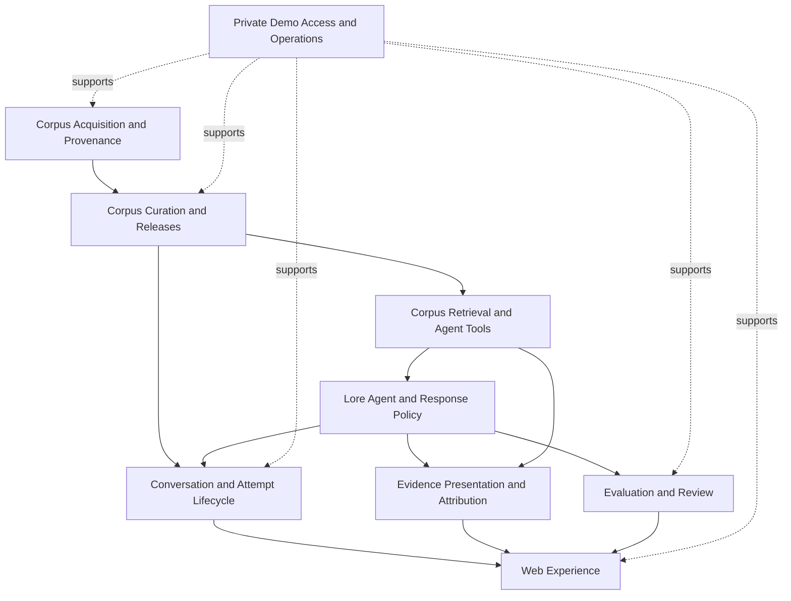

# Halls of Knowledge Specification Suite

> **Version**: 0.2.0
> **Last Updated**: 2026-07-18
> **Purpose**: Navigate and author the behavior contracts for implementing Halls of Knowledge from scratch.

---

## Project summary

Halls of Knowledge is a private, password-protected Tolkien-lore AI chat demo for a small invited audience, primarily Tolkien newcomers. It provides streamed, citation-grounded lore answers and explicitly requested, temporally grounded guide messages using only passages retrieved from a curated, immutable, versioned English Wikipedia corpus. The demo exists to validate grounding, abstention, provenance, guide generation, and a basic blinded retrieval ablation while excluding LOTRO-specific facts from its initial product boundary.

## Suite maturity

The vocabulary baseline and the three corpus-foundation specifications are approved. The remaining six system specs are `0.1.0` skeletons; do not treat their guidance prompts as approved requirements.

## Technology stack

| Component | Technology | Version | Purpose |
|-----------|------------|---------|---------|
| Application language | Python | To be pinned | One language for the modular monolith, web application, agent services, and offline corpus commands |
| Web framework | FastAPI | To be pinned | HTTP endpoints and HTML-oriented streaming transport |
| Server rendering | Jinja | To be pinned | Trusted server-rendered HTML |
| Incremental interaction | HTMX | To be pinned | Ordinary HTML-driven browser interactions |
| Interactive islands | Native Web Components | Web-platform baseline to be pinned | Narrow dependency-light browser state and lifecycle ownership |
| Agent orchestration | LangChain DeepAgent | To be pinned | Initial lore-agent orchestration with a later LangGraph descent available when justified |
| Persistence | SQLite | To be pinned with Python runtime | Conversations, generation attempts, and evaluation reviews |
| Corpus retrieval | SQLite full-text search | Supplied by pinned Python/SQLite runtime | Initial active-corpus keyword index and lore-agent retrieval tools |
| Backend tests | pytest | To be pinned | Service, cancellation, endpoint, and stream-contract verification |
| Browser tests | Cypress | To be pinned | Real-server end-to-end visitor and reviewer journeys |
| Deployment | AWS single instance | Packaging undecided | Private demo hosting with persistent local storage |

Model/provider, parser implementation, artifact serialization, exact SQLite tokenizer/weights, AWS packaging, and reverse proxy remain implementation choices or deliberately unresolved selections. Their observable contracts are fixed only where authored specs say so.

## Reading order

An agent MUST first read [SPEC-OF-SPECS.md](SPEC-OF-SPECS.md), then follow this order.

### Phase 1: Language and parameters

1. **[UBIQUITOUS_LANGUAGE.md](UBIQUITOUS_LANGUAGE.md)** — Canonical domain vocabulary and flagged ambiguities.
2. **[DESIGN_LANGUAGE.md](DESIGN_LANGUAGE.md)** — Shared web, evaluation, and operator-interface vocabulary.
3. **[parameters.md](parameters.md)** — Confirmed values, rationale, and unresolved selections.

### Phase 2: Corpus foundation

4. **[corpus-acquisition-and-provenance.md](corpus-acquisition-and-provenance.md)** — Reproducible source acquisition and article artifacts.
5. **[corpus-curation-and-releases.md](corpus-curation-and-releases.md)** — Human curation and immutable release governance.
6. **[corpus-retrieval-and-agent-tools.md](corpus-retrieval-and-agent-tools.md)** — Rebuildable retrieval and the path-hiding corpus tool boundary.

### Phase 3: Response core

7. **[lore-agent-and-response-policy.md](lore-agent-and-response-policy.md)** — The lore agent’s orchestration and response rules.
8. **[evidence-presentation-and-attribution.md](evidence-presentation-and-attribution.md)** — Citation, source-list, and attribution materialization.
9. **[conversation-and-attempt-lifecycle.md](conversation-and-attempt-lifecycle.md)** — Live conversation and generation-attempt state.

### Phase 4: Surfaces and assurance

10. **[web-experience.md](web-experience.md)** — Visitor and reviewer browser behavior.
11. **[evaluation-and-review.md](evaluation-and-review.md)** — Controlled ablation and blinded human review.
12. **[private-demo-access-and-operations.md](private-demo-access-and-operations.md)** — Access, deployment, persistence, secrets, and operations.

## Dependency graph

A solid `A → B` edge means B consumes a contract owned by A. A dashed edge means orthogonal operational support rather than domain ownership.

## Key dependencies

| Spec | Depends On | Depended By |
|------|------------|-------------|
| Corpus Acquisition and Provenance | — | Corpus Curation and Releases |
| Corpus Curation and Releases | Corpus Acquisition and Provenance | Corpus Retrieval and Agent Tools; Conversation and Attempt Lifecycle |
| Corpus Retrieval and Agent Tools | Corpus Curation and Releases | Lore Agent and Response Policy; Evidence Presentation and Attribution |
| Lore Agent and Response Policy | Corpus Retrieval and Agent Tools | Conversation and Attempt Lifecycle; Evidence Presentation and Attribution; Evaluation and Review |
| Evidence Presentation and Attribution | Corpus Retrieval and Agent Tools; Lore Agent and Response Policy | Web Experience |
| Conversation and Attempt Lifecycle | Corpus Curation and Releases; Lore Agent and Response Policy | Web Experience |
| Web Experience | Conversation and Attempt Lifecycle; Evidence Presentation and Attribution; Evaluation and Review | — |
| Evaluation and Review | Lore Agent and Response Policy | Web Experience |
| Private Demo Access and Operations | Operational knowledge of hosted surfaces | Orthogonally supports corpus, lifecycle, web, and evaluation systems |

## Quick reference

| Artifact | Description | Version |
|----------|-------------|---------|
| [SPEC-OF-SPECS.md](SPEC-OF-SPECS.md) | Suite constitution and authoring rules | 1.0.0 |
| [UBIQUITOUS_LANGUAGE.md](UBIQUITOUS_LANGUAGE.md) | Canonical domain vocabulary | 0.2.0 |
| [DESIGN_LANGUAGE.md](DESIGN_LANGUAGE.md) | Interface vocabulary and interaction preamble | 0.2.0 |
| [parameters.md](parameters.md) | Shared values and rationale | 0.2.0 |
| [corpus-acquisition-and-provenance.md](corpus-acquisition-and-provenance.md) | Approved source acquisition and article-artifact contract | 1.0.0 |
| [corpus-curation-and-releases.md](corpus-curation-and-releases.md) | Approved curation cockpit and immutable-release contract | 1.0.0 |
| [corpus-retrieval-and-agent-tools.md](corpus-retrieval-and-agent-tools.md) | Approved active-corpus keyword retrieval and agent-tool contract | 1.0.0 |
| [lore-agent-and-response-policy.md](lore-agent-and-response-policy.md) | Lore-agent system skeleton | 0.1.0 |
| [evidence-presentation-and-attribution.md](evidence-presentation-and-attribution.md) | Evidence presentation system skeleton | 0.1.0 |
| [conversation-and-attempt-lifecycle.md](conversation-and-attempt-lifecycle.md) | Conversation lifecycle system skeleton | 0.1.0 |
| [web-experience.md](web-experience.md) | Browser experience system skeleton | 0.1.0 |
| [evaluation-and-review.md](evaluation-and-review.md) | Evaluation system skeleton | 0.1.0 |
| [private-demo-access-and-operations.md](private-demo-access-and-operations.md) | Access and operations system skeleton | 0.1.0 |
| [SPEC-OF-SPECS-PLAN.md](SPEC-OF-SPECS-PLAN.md) | Spec-authoring progress tracker | 0.2.0 |

## Specification-authoring checklist

### Foundation

- [x] Establish the canonical ubiquitous language.
- [ ] Review and approve the initial design language.
- [ ] Resolve or explicitly defer every open parameter selection.

### Corpus

- [x] Author and approve Corpus Acquisition and Provenance.
- [x] Author and approve Corpus Curation and Releases.
- [x] Author and approve Corpus Retrieval and Agent Tools.

### Response core

- [ ] Author and approve Lore Agent and Response Policy.
- [ ] Author and approve Evidence Presentation and Attribution.
- [ ] Author and approve Conversation and Attempt Lifecycle.

### Surfaces and assurance

- [ ] Author and approve Web Experience.
- [ ] Author and approve Evaluation and Review.
- [ ] Author and approve Private Demo Access and Operations.

### Implementation readiness

- [ ] Promote every system spec to `1.0.0` after human review.
- [ ] Verify all parameters have values and rationale.
- [ ] Verify all test-scenario indexes and cross-references.
- [ ] Create an implementation plan only after the specification baseline is approved.
